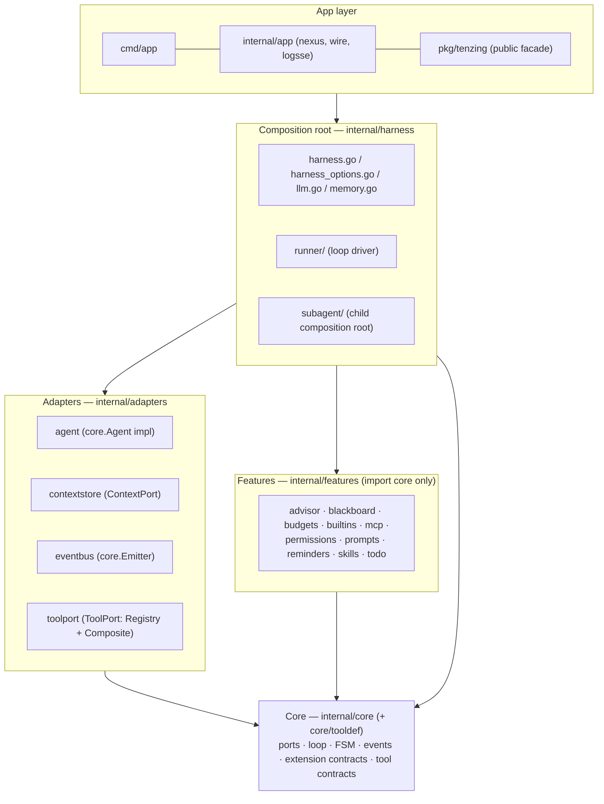
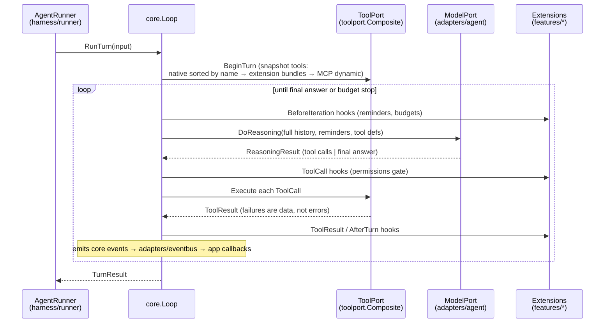

# System Architecture

The single architecture document for `tenzing-agent-harness`: the conceptual model for onboarding plus the full reference. Every claim carries the path where the code lives; when this document and the code disagree, the code wins (see `AGENTS.md`).

## 1. System Overview

**What it is:** a Go harness for running LLM agents — a reasoning loop that feeds conversation history to a model, executes the tool calls it returns, and repeats until the model produces a final answer. It ships built-in tools (bash/read/edit/grep/glob), a skills system, a shared Python-REPL "blackboard" for multi-agent work, subagent spawning, MCP server integration, and guardrails (permissions, budgets).

**Runtime model:** a library first (`pkg/tenzing` facade), with an application entrypoint (`cmd/app`) and an app-layer server component (`internal/app/nexus`).

**Core technologies:** Go stdlib, `github.com/tab58/llm-providers` (external module; Anthropic/OpenAI-style model clients under `common.*` types), MCP Go SDK (`internal/features/mcp`), a sandboxed Python subprocess (`internal/features/blackboard/repl.go` + `bootstrap.py`).

Go module: `github.com/tab58/tenzing-agent-harness` (go 1.25.9)

## 2. The Layer Model

The architecture is hexagonal (ports & adapters), organized **package-by-feature** rather than package-by-layer where it matters. Five layers, one import rule each:

| Layer | Folder | May import | Role |
|---|---|---|---|
| **Core** | `internal/core/` (+ `core/tooldef/`) | nothing from `internal/` (external `llm-providers/common` allowed) | Domain vocabulary, all port interfaces, the reasoning loop |
| **Adapters** | `internal/adapters/{agent, contextstore, eventbus, toolport}` | core | One package per port implementation |
| **Features** | `internal/features/*` (10 packages) | core only — never each other, never adapters | Self-contained capabilities; each registers itself via a colocated `ext.go` |
| **Composition root** | `internal/harness/` (+ `runner/`, `subagent/`) | everything below | Builds adapters + features, wires the loop |
| **App** | `internal/app/`, `cmd/app`, `pkg/tenzing` | harness public API | Entrypoints and the public facade |

The whole discipline compresses to one sentence: **core imports nothing, adapters import core, features import core, harness imports everything.** Folder depth = layer. If you're unsure where new code goes, that sentence answers it.



### Deliberate exceptions (all three are documented, none is an accident)

1. `harness.New`'s unexported `defaultAgentBuilder` imports `internal/adapters/agent` so a harness works with no brain injection (`internal/harness/harness.go`); everything else talks to `core.Agent`. Override with `harness.WithAgentBuilder`.
2. `internal/harness/subagent` is a **child composition root**: it builds a full child runner (registry, context store, extensions) per spawned agent, so it imports features and `runner/` by design (`subagent_factory.go`).
3. `internal/core` imports the external `llm-providers/common` module (message and tool-definition types, e.g. `core.ProviderToolDefinition = common.ToolDefinition` in `core/turn.go`). The rule is "core imports nothing from `internal/`", not "core imports only stdlib".

## 3. Design Goals

**Everything that isn't invariant is configurable.** The loop (perception → action → observation), the FSM, and the dispatch pattern (`name → handler(input)`) are structural invariants — they live in `core.Loop` and never change. Everything else is injectable: which model (via `ModelPort`), which tools (via `ToolPort`), which context store (via `ContextPort`), which extensions, which system prompt.

**Port interfaces are the DI surface.** All non-invariant loop behavior flows through `ModelPort`, `ToolPort`, `ContextPort`, and `Extensions`. The `AgentRunner` options (`WithToolRegistry`, `WithToolPort`, `WithContextStore`, etc.) remain the external API but internally build the ports and delegate to `core.NewLoop`.

**The loop never changes.** New capabilities are added by registering tools or wrapping the loop with new mechanisms (planning, subagents, context compression) — never by modifying the loop itself.

**Tools are the only extension point.** Adding a capability = one registry entry, zero loop changes. Tool descriptions are instructions, not documentation — precise wording controls model tool selection. Tools never throw; errors are strings the agent interprets.

**Provider agnosticism.** All LLM interaction flows through canonical types (`Message`, `ContentBlock`, `CompletionRequest/Response`). Provider implementations convert to/from SDK-specific types. Swapping providers requires zero changes above the provider layer.

**Risk changes the process.** The permissions extension (`internal/features/permissions`, a `core.ToolCallHook` registered FIRST in the default extension order) classifies each tool call: `Deny` > `Ask` > `Allow` > policy default, matched case-insensitively by tool name plus origin prefixes. The default policy asks for anything that executes code or writes files (`bash`, `write`, `edit`, `repl`, `spawn_agent`, `advisor`) and for every MCP-origin tool (`AskOrigins: ["mcp:"]`); everything else is allowed. `AskUser` makes the core loop emit `ApprovalRequestedEvent` and block (up to `ApprovalTimeout`, harness default 120s; timeout/cancel = deny) for a `Respond(bool)` — cmd/app forwards it over SSE as `approval.requested` and resolves it via `POST /approve {call_id, approved}` with approve/deny buttons in the embedded UI. Configure with `harness.WithPermissionPolicy`, opt out with `harness.WithPermissionsDisabled` (headless/trusted drivers), tune waiting with `harness.WithApprovalTimeout`. `harness.WithReadOnly` (CLI `--read-only`) is the no-approver mode: it REPLACES the permissions extension with a `readOnlyExt` hook (`internal/harness/readonly.go`, shared with subagent loops) that denies every call whose tool is not marked read-only per `Composite.ReadOnly` (unmarked/unknown = mutating) — `WithPermissionPolicy` is ignored, no `AskUser` escalation exists (MCP tools' own read-only claims are trusted), and the approval timeout is forced to 0 so no prompt ever fires. `advisor` is marked read-only (pure LLM call, `internal/features/advisor`); `spawn_agent` is exempt by name because child loops carry the same gate — spawned agents cannot mutate the filesystem, only shared in-memory blackboard state. The check happens in the core loop before tool execution — not in the tool itself, not in the Agent.

**Long tasks have budgets.** The budgets extension (`internal/features/budgets`, a `core.BeforeIterationHook`) enforces per-turn limits — `MaxIterations`, `MaxWallClock`, `MaxTokens` (input+output cumulative); zero = unlimited. The loop populates `TurnContext.Elapsed/InputTokens/OutputTokens` before each iteration's hooks; when a limit trips the extension sets `Terminate` and the turn ends gracefully with `TurnResult{Terminated: reason}` — a result, not a crash. Wire via `harness.WithBudgets(limits)`; subagents get `MaxIterations` from `WithSubagentMaxIterations` (default 100) through the same extension. Cost budget (USD) is deferred at the harness level — pricing now exists in cmd/app (models.yaml per-MTok costs feed the server's `costTracker`, `cmd/app/costs.go`), but `budgets.Limits` has no `MaxCost` field yet.

**Context is assembled, not dumped.** The system prompt is ordered by stability for cache efficiency: Layer 0 (system policies, stable prefix, cached) → Layer 1 (skill definitions, rarely change, cached) → Layer 2 (session instructions, per conversation, not cached) → Layer 3 (JIT-retrieved tool outputs, fresh, not cached). Untrusted data (user input, tool output from external sources) is marked with trust labels so the harness can treat it differently. *(Partially implemented — skills use progressive disclosure, but no cache-aware ordering or trust labels yet.)*

**Registries own implementations, Agent gets metadata.** Tools and skills follow the same wiring pattern: registries load from disk at startup, extensions surface them through the composite ToolPort and prompt fragments, and the core loop passes the per-turn tool definitions into every `DoReasoning` call. The Agent holds no capability state at all — it tells the LLM what capabilities exist (from the definitions handed to it per request), and the loop actually runs them.

```
harness.New(...)
  ├── skills.NewRegistry()                  → empty registry; RegisterSkillDir(dir)
  │                                            scans each dir for skill metadata
  │                                            (default dir: ~/.claude/skills)
  ├── toolport.NewRegistry(cwd)              → empty registry
  │     └── builtins.Defaults() registered   → seeds the standard native tool set
  │
  ├── Agent gets metadata only:
  │     ├── toolPort.Definitions()           → what tools exist (native + extension + dynamic)
  │     └── skills.Ext.PromptFragment()      → what skills exist (system-prompt index)
  │
  └── AgentRunner gets ports for execution:
        └── toolport.Composite               → executes tool calls
```

## 4. Repository Layout

```
cmd/app/main.go                         Entry point — signal handling, banner, exit codes
cmd/app/root.go                         cobra root command `tenzing` — flags, registry load, model precedence, dispatches to print or serve mode
cmd/app/options.go                      cliConfig struct + harnessOptions(cfg) — flags → HarnessOptions
cmd/app/container.go                    AppContainer — config, logging, trust + project config, agent server + HTTP server wiring
cmd/app/print.go                        Print mode — one-shot turn (with @path.png image args), text/JSONL output, exit codes
cmd/app/models.go                       Model registry — models.yaml loading + resolution (loadModelRegistry, resolveModel, modelKey, modelList, --list-models)
cmd/app/costs.go                        costTracker — token + USD accounting from LLMResponseEvents (pricing from models.yaml)
cmd/app/trust.go                        Project trust gate — trust.json persistence, resolveProjectTrust/setProjectTrust
cmd/app/projectconfig.go                Drop-in config — SYSTEM.md/APPEND_SYSTEM.md overrides + prompt-template dirs, trust-gated
cmd/app/server.go                       agentServer — routes (/query, /cancel, /steer, /state, /approve, /sessions, /messages, /compact,
                                        /thinking, /model, /models, /stats, /trust, /info, /debug, /ingest/{name}), turn queue, SSE broadcast, event forwarding
cmd/app/index.go                        Embedded chat UI (single-page HTML served at /; image attachments, live cost display)

pkg/tenzing/                             Public facade — pure alias/re-export, no logic
├── tenzing.go                          Harness, options, core/tooldef/eventbus type re-exports
├── models.go                           StandardModels() — the model registry the CLI derives from
└── llm.go                              LLM/CompletionRequest/Message etc. re-exports + client constructors

internal/
├── core/                                Invariant domain: types, FSM, events, loop, all ports, the Agent
│                                        contract, tool authoring contract; imports nothing from internal/
│   ├── agent.go                        Agent interface (the runner-facing "brain" contract)
│   ├── turn.go                         Domain types (ToolCall, ToolResult, ReasoningResult, ResponseMeta,
│   │                                    ProviderToolDefinition = common.ToolDefinition, ToolSpec)
│   ├── ports.go                        Port interfaces (ModelPort, ToolPort, ContextPort)
│   ├── loop.go                         Loop struct, NewLoop, RunTurn — the invariant agent loop
│   ├── fsm.go                          Per-runner finite state machine (6 states, 6 transitions)
│   ├── extension.go                    Extensions, hooks, Decision, TurnContext, TurnResult
│   ├── event.go                        Event interface, BaseEvent, Emitter, EventType constants
│   ├── event_types.go                  Concrete event struct types (ApprovalRequestedEvent lives in approval.go)
│   ├── approval.go                     ApprovalRequestedEvent, Loop.requestApproval/waitApproval
│   └── tooldef/                        Tool authoring contract
│       └── tooldef.go                  Definition, ExecutionContext, Schema, NewToolResult, SpecFromDefinition
├── adapters/                            Port implementations; import core only
│   ├── agent/                          core.Agent: stateless ModelPort-side brain
│   │   └── agent.go                    Agent struct, AgentConfig, DoReasoning — owns no history/tools/memory
│   ├── contextstore/                   ContextPort: in-memory history, pairing, compression
│   │   ├── store.go                    Store — implements core.ContextPort
│   │   └── compressor/                 Three-layer compression
│   │       └── compressor.go           Compressor — EstimateSize, MaybeCompress
│   ├── eventbus/                       core.Emitter implementation + typed Hooks dispatcher
│   │   ├── bus.go                      EventBus — fan-out to buffered subscriber channels
│   │   └── hooks.go                    Hooks struct, StartHooks — typed callback dispatch off the bus
│   └── toolport/                       ToolPort: Composite (native + extension + dynamic mounts, panic
│       │                                recovery) and Wrap (plain registry port), plus the native Registry
│       ├── composite.go                Composite, NewComposite
│       ├── registry.go                 Registry, NewRegistry(cwd) — empty; composition roots seed it
│       └── toolport.go                 Wrap(registry) → core.ToolPort
├── app/                                 App-level wiring shared by cmd/app
│   ├── logsse.go                        LogBroadcaster — io.Writer teeing slog output to /debug SSE
│   ├── wire/                           Versioned JSONL/SSE wire schema (Envelope, per-event payloads)
│   │   └── wire.go                     Version, Envelope, ToWire, delta envelopes, unknown_event fallback
│   └── nexus/                          Input channel monitoring (see "Nexus" below)
│       └── tools/                      Channel tools: list_channels, read_channel, search_channel
├── features/                            core.Extension implementations; each imports core only (+ tooldef)
│                                        and colocates its registration in ext.go
│   ├── advisor/                        Tool — stateless one-shot LLM consult, registered only via
│   │                                    WithAdvisorModel
│   ├── blackboard/                     Shared Python REPL (Blackboard, REPL, Querier) + its Ext
│   │   ├── blackboard.go               Blackboard: lazy-start REPL, Execute/Deposit
│   │   ├── bootstrap.py                Embedded Python REPL (//go:embed)
│   │   ├── ext.go                      Ext — ToolProvider (repl) + SessionEndHook (blackboard.NewExt)
│   │   ├── preview.go                  Preview (fixed-truncation summaries); package doc lives here
│   │   ├── querier.go                  Querier interface + llmQuerier (stateless one-shot LLM calls)
│   │   ├── repl.go                     Python subprocess + JSON-line IPC
│   │   └── tool_repl.go                repl tool (REPLTool)
│   ├── budgets/                        BeforeIterationHook — iteration/wall-clock/token limits → graceful
│   │                                    Terminate
│   ├── builtins/                       Native built-in tools + Defaults() seed set
│   │   ├── defaults.go                 Defaults() — bash, Read, Edit, Write, Grep, Glob, ls; one FileTracker
│   │   │                                per call shared by Read/Edit/Write
│   │   ├── file_tracker.go             Read-before-edit enforcement (content hashing)
│   │   ├── fsutil.go                   resolvePath, atomic file writes, per-path locks
│   │   ├── tool_bash.go                Shell command execution (120s timeout)
│   │   ├── tool_edit.go                String replacement in file (tracker-verified, atomic write)
│   │   ├── tool_glob.go                File pattern matching
│   │   ├── tool_grep.go                Regex search across files (cap 500)
│   │   ├── tool_ls.go                  Directory listing (cap 500 entries)
│   │   ├── tool_read.go                File read with line numbers (stamps tracker)
│   │   └── tool_write.go               File create/overwrite (tracker-verified, atomic write, mkdir -p)
│   ├── mcp/                            DynamicToolSource + session hooks — external MCP servers over stdio
│   │   └── ext.go                      Ext, ServerConfig, New — package mcp (harness.WithMCPServer(mcp.ServerConfig{...}))
│   ├── permissions/                    ToolCallHook — name/origin policy gating (default-on, runs first)
│   ├── prompts/                        System prompt construction
│   │   ├── prompts.go                  DefaultSystemPrompt()
│   │   └── default_main.gotmpl         Base system prompt template
│   ├── reminders/                      BeforeIterationHook — injects TODO-plan-state system reminders
│   ├── skills/                         Skill discovery & lazy loading + its Ext
│   │   ├── ext.go                      Ext — ToolProvider (list_skills/load_skill) + PromptContributor
│   │   │                                (skills index); skills.NewExt
│   │   ├── registry.go                 Discover frontmatter at startup, Load on demand
│   │   ├── tool_list_skills.go         List available skills (interface: SkillLister)
│   │   └── tool_load_skill.go          Load skill content (interface: SkillContentLoader)
│   └── todo/                           In-memory planning system
│       ├── todo_file.go                TodoFile — per-instance in-memory store with IDs, deps, priorities,
│       │                                topo sort; SetEmitter(core.Emitter)
│       ├── tool_todowrite.go           Bulk-write plan with dependency-by-index
│       ├── tool_todocreate.go          Add single task mid-execution
│       ├── tool_todoupdate.go          Update task status by ID
│       ├── tool_todonext.go            Get next unblocked task
│       └── tool_todoread.go            Read plan in dependency order
└── harness/                            Composition root: wiring, config, memory persistence
    ├── harness.go                      New(), Harness struct, Shutdown, RunTurn — builds ports/adapters and
    │                                    wires core.Loop via runner.AgentRunner; defaultAgentBuilder falls
    │                                    back to adapters/agent (the one upward import)
    ├── harness_options.go              HarnessOption functional options (no config struct)
    ├── llm.go                          llmCache, defaultLLMFactory — per-(provider,model,baseURL) client
    │                                    caching
    ├── memory.go                       memoryStore — persists ContextCompressedEvent summaries per
    │                                    conversation to disk; loaded back on WithConversationID resume
    ├── context_files.go                AGENTS.md context-file discovery (global + root-to-cwd), appended to
    │                                    the main system prompt (default-on; WithContextFilesDisabled)
    ├── gate.go                         ToolCallGate — pre-execution veto wired via WithToolCallGate
    ├── prompttmpl/                     Slash-command prompt templates (*.md dirs via WithPromptTemplatesDir,
    │                                    bash-style argument substitution)
    ├── session/                        Message-level JSONL session persistence (Store/persister, List/Load/
    │                                    Delete/Rename, DefaultDir; image sidecar blobs)
    ├── runner/                         AgentRunner facade over core.Loop
    │   ├── agent.go                    AgentBuilder func(common.LLM, string) (core.Agent, error)
    │   └── agent_runner.go             AgentRunner, AgentRunnerOption, NewAgentRunner — one-time agent
    │                                    wiring, builds core.Loop, RunLoop delegates to Loop.RunTurn
    └── subagent/                       Sub-agent delegation — a child composition root (imports features +
                                          runner by design)
        ├── subagent_factory.go         SubAgentFactory — builds child AgentRunner + Agent + contextstore.Store
        ├── spawn_ext.go                SpawnExt — mounts spawn_agent as a core.Extension (in-package to avoid
        │                                an import cycle)
        └── tool_spawn_agent.go         spawn_agent tool + AgentFactory interface

LLM provider layer: external module github.com/tab58/llm-providers
├── common/                             LLM interface + canonical message types
├── anthropic/, openai/, cerebras/,     One package per provider (constructors,
│   lightning/, openrouter/, ollama/    model definitions)
├── openai_compat/                      Shared OpenAI-compatible base + 429 retry
├── ratelimit/                          TokenBucket, Semaphore, Wrap decorator
└── logger/                             Optional diagnostics logger
```

## 5. Core Loop (`internal/core/loop.go`)

The agent loop is an FSM-driven perception→action→observation cycle owned by `core.Loop`. It drives three ports (`ModelPort`, `ToolPort`, `ContextPort`), runs extension hooks, and emits events. The loop never branches on model output beyond `stop_reason`. Each `Loop` owns its own FSM instance — subagents and concurrent loops don't share state.

```go
type LoopConfig struct {
    ID              string
    Model           ModelPort       // stateless reasoning (injectable)
    Tools           ToolPort        // tool execution (injectable)
    Context         ContextPort     // conversation history (injectable)
    Emitter         Emitter         // nil-safe event emitter
    Extensions      *Extensions     // nil -> NewExtensions()
    SystemPrompt    string          // for logging; ModelPort owns applying it
    FSM             *LoopFSM        // nil -> NewLoopFSM()
    ApprovalTimeout time.Duration   // AskUser wait bound; 0 = deny immediately
}

func NewLoop(cfg LoopConfig) (*Loop, error)
func (l *Loop) RunTurn(ctx context.Context, input string) (TurnResult, error)
func (l *Loop) ID() string
```

`RunTurn` returns `(TurnResult, error)`: `FinalAnswer`/`Iterations`/`Duration` on success; `Terminated` reason from the hook-terminate path (returned as `TurnResult{Terminated: reason}, nil` — not an error); real failures return the error.

### One turn, end to end



### State Machine

```
started ──StartReasoning──▶ reasoning_started ──FinishReasoning──▶ reasoning_finished
                                                                       │
                                                          ┌────────────┼────────────┐
                                                          ▼                         ▼
                                                tool_execution_started           stopped
                                                          │
                                              FinishToolExecution
                                                          ▼
                                              tool_execution_finished
                                                          │
                                                   (loops back to
                                                    started via Reset)
```

Six states, six transitions (`internal/core/fsm.go`). `Reset` can fire from any state, including `started` — `RunTurn` itself resets first thing, before the loop's first iteration. FSM is per-`Loop` instance.

### RunTurn Flow

```
Loop.RunTurn(ctx, input string) → (TurnResult, error)

1. context.AppendUser(ctx, input) — once, before the loop
2. Reset FSM
3. tools.BeginTurn(ctx); toolDefs := tools.Definitions() — snapshot the tool
   surface once per turn (composite re-reads dynamic sources here)
4. Loop (iteration = 1, 2, ...):
   a. Check ctx cancellation
   b. StartReasoning
   c. extensions.RunBeforeIteration(ctx, turnCtx) — load-bearing; hooks append
      turnCtx.Reminders and may set turnCtx.Terminate for graceful termination
      (Terminate set → Reset FSM, return TurnResult{Terminated: reason}, nil — not an error)
   d. messages := context.Messages(ctx)
   e. reasoningResult := model.DoReasoning(ctx, messages, turnCtx.Reminders, toolDefs)
   f. FinishReasoning
   g. If ToolCalls is empty (final answer):
      - context.AppendAssistant(ctx, reasoningResult.Meta.AssistantMessage)
      - if the answer is empty, looks like a tool call written as plain text, or
        was truncated at the output token limit, and fewer than 2 retries have
        been used: context.AppendUser(ctx, a retry instruction) → loop to 4a
      - else: Stop, extensions.RunAfterTurn(ctx, &tr) (degrading), return
        TurnResult{FinalAnswer, Iterations, Duration}
   h. Else (tool calls present) — batch semantics:
      - StartToolExecution
      - DECISION PHASE, sequential in issue order: extensions.RunToolCall(ctx, tcc)
        (load-bearing; hooks may escalate Decision to Deny/AskUser, never
        de-escalate; a hook error itself also blocks execution with a synthetic
        result, distinct from an explicit Deny). AskUser calls emit their
        ApprovalRequestedEvent immediately (non-blocking).
      - EXECUTION PHASE, segmented: runs of consecutive read-only calls (per
        ToolPort.ReadOnly) execute concurrently — one goroutine per call,
        bounded by maxParallelReadOnlyTools (8) — while mutating (unmarked)
        calls act as barriers and run alone. Results land by index so feedback
        keeps issue order. Allow executes; Deny/hook-error produce synthetic
        error results; AskUser waits out its approval channel inside its own
        execution slot (read-only neighbors in the same segment don't wait on
        the straggler; a mutating AskUser call blocks later segments until
        resolved). Per-call events (ToolExecutionStarted/Finished,
        succeeded/failed) fire inside the goroutines — EventBus.Emit is
        goroutine-safe.
      - after the barrier: extensions.RunToolResult(ctx, trc) sequentially in
        issue order (degrading transform)
      - FinishToolExecution
      - context.AppendAssistant(ctx, reasoningResult.Meta.AssistantMessage), then
        one context.AppendToolResults(ctx, outputs) in issue order — results
        carry ToolUseID so the store pairs them to the assistant's tool_use
        blocks; the context store is only touched after the barrier
      - STEERING: messages queued via Loop.Steer are drained here (the tool
        boundary) — each is context.AppendUser'd after the tool results and
        emits SteeringInjectedEvent, so tool_use/tool_result pairing is never
        split by an interleaved user message
      - loop to 4a
5. On any error: Reset FSM, emit ErrorEvent, return the error
```

Exit: model produces `ReasoningResult{ToolCalls: nil}` with a valid final answer, or a `BeforeIteration` hook sets `TurnContext.Terminate` (graceful termination — a `TurnResult`, not an error).
Error: ctx canceled, an FSM transition error, `BeforeIteration` hook error, `DoReasoning` error, or a `ContextPort` append error.

## 6. Agent Interface

```go
type Agent interface {
    GetCurrentModel() string
    UpdateStreamCallback(fn func(text string))
    UpdateThinkingCallback(fn func(text string))
    DoReasoning(ctx context.Context, messages []common.Message, systemReminders []string, tools []common.ToolDefinition) (ReasoningResult, error)
}

type ReasoningResult struct {
    ToolCalls   []core.ToolCall  // empty → final answer ready
    FinalAnswer string           // populated when ToolCalls is empty
    Meta        ResponseMeta
}

type ResponseMeta struct {
    Model, ResponseID, StopReason string
    InputTokens, OutputTokens     int64
    AssistantText                 string
    AssistantMessage               common.Message // full response, for the caller to append
}
```

The `Agent` interface is `core.Agent`, declared in `internal/core/agent.go`; `ReasoningResult`/`ResponseMeta` live alongside it in `internal/core/turn.go`. The runner (`internal/harness/runner`) works with `core.Agent` directly. `core.ModelPort` (`internal/core/ports.go`) mirrors the `DoReasoning` signature; `core.Agent` extends it with the `Update*` construction-time wiring calls. The relationship is structural (no declared subtyping or compile-time assertion) — see Known Design Issues.

The Agent is **stateless**: `messages` is the full conversation history, rebuilt from the runner's `core.ContextPort` on every call, and `tools` is the tool surface for the turn, snapshotted from the loop's `core.ToolPort`. The agent neither stores nor mutates them, and returns the model's full response via `Meta.AssistantMessage` rather than appending it anywhere — the runner does that, against its `ContextPort`. `systemReminders` carries the current todo plan state.

The concrete implementation lives in `internal/adapters/agent/` (package `agent`). Tool definitions are applied per-request from the `tools` parameter — the agent holds no tool state.

```go
type AgentConfig struct {
    Model        common.LLM
    SystemPrompt string // fully assembled by the composition root (base + extension fragments)
}
```

Constructor: `New(cfg)`. The agent builds a `CompletionRequest` from the passed-in messages each reasoning cycle and parses the `CompletionResponse` into `ReasoningResult`. It owns no history, no compression, and no memory file I/O — see "Context Compression" and `ContextPort` below.

### ContextPort

```go
type ContextPort interface {
    Messages(ctx context.Context) ([]common.Message, error)
    AppendUser(ctx context.Context, text string) error
    AppendUserContent(ctx context.Context, blocks []common.ContentBlock) error
    AppendAssistant(ctx context.Context, msg common.Message) error
    AppendToolResults(ctx context.Context, results []ToolResult) error
}
```

`AppendUserContent` carries mixed-block user messages (text + images) — `Loop.RunTurnWithImages` uses it; `Harness.RunTurnWithImages` fails fast with `ErrVisionUnsupported` when the current model lacks vision (`Harness.SupportsVision`, tracking `SetModel` switches) and emits `ImagesAttachedEvent` (full base64 payloads; the wire envelope reports only count + media types). The compressor charges each image block a flat ~1600-token estimate rather than its base64 length.

Declared in `internal/core/ports.go`; owns the conversation — user/assistant messages, `tool_use`/`tool_result` pairing (a `tool_use` unanswered in the immediately following message is rejected by the Anthropic API), and compression. The `AgentRunner` holds one `ContextPort` per runner (`runner.WithContextStore`, required) and rebuilds `messages` from it every iteration.

The in-memory implementation is `internal/adapters/contextstore.Store` (`contextstore.New(contextstore.Config{LLM, InitialMemory, Emitter, RunnerID})`). `harness.New` builds one per main runner (seeded with resumed `InitialMemory`) and `subagent.SubAgentFactory` builds a fresh one per spawned child (no `InitialMemory` — children don't resume). The store emits `ContextCompressedEvent` itself on compaction, stamped with its own `RunnerID`.

## 7. Adapters — `internal/adapters/`

One package per port implementation. All import core only.

| Package | Implements | Notes |
|---|---|---|
| `agent/` | `core.Agent` | The default brain: wraps an `llm-providers` client, translates `DoReasoning` into provider calls (`agent.go`) |
| `contextstore/` | `core.ContextPort` | Conversation history + compression (`store.go`, `compressor/` subpackage) |
| `eventbus/` | `core.Emitter` | Fan-out pub/sub `EventBus` (`bus.go`) plus `Hooks`/`StartHooks` — a dispatcher turning bus events into app callbacks (`hooks.go`) |
| `toolport/` | `core.ToolPort` | The native `Registry` (`registry.go` — name-keyed `tooldef.Definition` store; `NewRegistry(cwd)` starts **empty**, seeding is the composition root's job), the `Composite` (`composite.go`) that mounts all tool sources, and `Wrap(reg)` adapting a bare registry to `core.ToolPort` (`toolport.go`) |

## 8. Harness (Composition Root)

Deliberately thin orchestrator. Holds the main runner, optionally registers the subagent tool. No loop logic, no tool dispatch, no reminders.

```go
type Harness struct {
    mainAgentRunner *runner.AgentRunner
    toolPort        *toolport.Composite
    todoFile        *todo.TodoFile
    eventBus        *eventbus.EventBus
    stopHooks       func()          // unsubscribes caller-supplied eventbus.Hooks
    stopMemoryHook  func()          // unsubscribes the ContextCompressedEvent -> memory.go persister
    extensions      *core.Extensions
}
```

The shared `*blackboard.Blackboard` is built locally inside `New()` (not a Harness field) and wrapped in a `blackboard.NewExt(bb, "main")` extension alongside the subagent factory's per-child `NewExt(bb, childID)` — one instance, shared.

Constructor: `New(mainModel common.ModelDefinition, opts ...HarnessOption) (*Harness, error)`. Behavior is configured via flat `HarnessOption` functions (`internal/harness/harness_options.go`) applied over `defaultHarnessOptions()` (defaults: subagent depth 1, subagent max iterations 100, approval timeout 120s, skills dir `~/.claude/skills`, fresh event bus):

- `WithAgentBuilder` — replaces the default agent implementation with a custom `runner.AgentBuilder`; the test seam for stub brains.
- `WithSubagentModel` / `WithBlackboardModel` / `WithAdvisorModel` — per-role `common.ModelDefinition`; an unset role falls back to `mainModel`. The advisor tool is registered only when `WithAdvisorModel` is set (no advisor by default). `WithBlackboardModel` sets the model used for `llm_query`/`llm_batch` sub-LM calls inside the shared blackboard REPL.
- `WithSubagentDepth` (default 1, 0 disables `spawn_agent`) / `WithSubagentMaxIterations` (default 100 per child).
- `WithLLMFactory` — replaces the default env-var-based LLM factory (`provider.LLMFromEnv`) entirely; the test seam for injecting fakes.
- `WithProviderBaseURL(provider, url)` — per-provider base URL override, consumed by the default factory only.
- The shared blackboard REPL (`repl` tool) is always on; the Python process boots lazily on first use.
- `WithSessionDir` / `WithSessionDisabled` — message-level JSONL session persistence knobs (default on, `<UserConfigDir>/tenzing/sessions`).
- `WithPromptTemplatesDir` — `*.md` slash-command templates expanded in `RunTurn` queries.
- `WithContextFilesDisabled` — turns off the default AGENTS.md ancestor-chain prompt append (main agent only, 32KB cap).
- `WithToolCallGate` — shared pre-execution veto for every tool call (main + subagents), run as an extension ToolCallHook after permissions.
- `WithThinking` / `WithLLMRetry` / `WithCompressionThreshold` / `WithCompressionKeepMessages` — reasoning toggle, transient-error retry policy, and compression tuning for the default brain/context store.
- `WithDisabledTool`, `WithSkillsDir`, `WithTool`, `WithHooks(eventbus.Hooks)`, `WithSystemPrompt`, `WithEventBus`, `WithTextDeltaHandler`/`WithThinkingDeltaHandler` (`func(runnerID, text string)` — deltas are tagged with the emitting runner's id), `WithBudgets`, `WithMCPServer`, `WithPermissionPolicy`, `WithPermissionsDisabled`, `WithReadOnly`, `WithApprovalTimeout`, `WithConversationID`, `WithExtension` — remaining registry/observability/extension knobs.

LLM clients are cached per (provider, model, base URL) via an internal `llmCache` (`internal/harness/llm.go`), so roles sharing a model definition share one client and its rate limiter.

The brain defaults to the built-in agent implementation: when no `WithAgentBuilder` is set, `harness.New` falls back to an unexported `defaultAgentBuilder` wrapping `agent.New` (`internal/adapters/agent`) — the one place `internal/harness` imports `internal/adapters/agent`.

### Construction flow

`harness.New` (`internal/harness/harness.go`) → resolve models → `skills.NewRegistry()` + `RegisterSkillDir` per configured dir → build shared `blackboard.New(...)` (unless disabled) → assemble default extensions in order: permissions (unless disabled), reminders, budgets (if limits set), mcp (if servers configured), `blackboard.NewExt(bb, "main")`, `subagent.NewSpawnExt(factory)` (if depth > 0), then user `WithExtension`s → `toolport.NewRegistry(cwd)` seeded with `builtins.Defaults()`, `RegisterFromProvider(todoFile)`, advisor tool (if `WithAdvisorModel`), user `WithTool`s → render system prompt (`features/prompts` base + extension `PromptFragments`) → `runner.NewAgentRunner(...)` → `core.NewLoop`.

### Turns

`RunTurn(ctx, query)` — runs one agent turn via `RunLoop` and returns the answer. `cmd/app` drives turns over HTTP (`POST /query`) and streams progress via SSE in serve mode (default), or via a single headless `RunTurn` call in print mode (`-p`).

`Steer(msg)` — queues a user message (buffer of 16; full buffer errors) for injection into the running main-agent loop at the next tool-execution boundary, after that batch's tool results are appended (so tool_use/tool_result pairing is never split). Each injection emits `SteeringInjectedEvent`. Messages queued while idle inject at the first boundary of the next turn. `LoopState()` reports the main loop FSM's current state (`started`, `stopped`, `reasoning_started`, …) so drivers can tell idle from mid-turn.

## 9. AgentRunner (Facade)

`AgentRunner` (`internal/harness/runner/agent_runner.go`) is a thin facade over `core.Loop`. It performs one-time agent wiring (stream/thinking callbacks) at construction time, builds a `core.Loop` via `core.NewLoop(core.LoopConfig{Model: agent, Tools: tp, Context: o.contextStore, Emitter, Extensions, SystemPrompt})` — where `tp` is the `core.ToolPort` from `WithToolPort` (the harness passes the composite) or a `toolport.Wrap(o.toolRegistry)` fallback — and `RunLoop` is a one-line delegate to `Loop.RunTurn`, translating `TurnResult` into the `(string, error)` contract the harness expects: a non-empty `Terminated` becomes `fmt.Errorf("terminated: %s", reason)` (with `FinalAnswer` still returned alongside), otherwise `FinalAnswer` passes through directly.

The runner has no `Cwd` — working directory is a tool execution concern owned by the `Registry`. The FSM, message assembly, hook dispatch, retry logic, and tool dispatch all live in `core.Loop.RunTurn` (`internal/core/loop.go`). `AgentRunner` owns none of it; it wires the three ports once at construction and forwards the call.

## 10. Tool System

Two tool vocabularies exist on purpose: `tooldef.Definition` is what you *write* (typed schema, execution context); `core.ToolSpec` is what the loop *mounts* (provider schema + `Execute` closure). `tooldef.SpecFromDefinition(def, origin)` bridges them.

### Composite ToolPort (`internal/adapters/toolport/composite.go`)

The loop's `core.ToolPort` in the harness is the `Composite`, which mounts three source kinds in stable definition order: native registry tools (sorted by name, `Origin: "native"`), extension `core.ToolProvider` bundles (registration order, `Origin: "extension:<name>"`), then `core.DynamicToolSource` snapshots (re-read at each turn's `BeginTurn`; e.g. MCP). Extension tools are `core.ToolSpec`s carrying their own `Execute` closure — no registry registration. Static name collisions are a construction error; dynamic collisions are skipped with a warning. Panic recovery lives in `Composite.Execute` — the single choke point for all mounts. `toolport.Wrap(registry)` remains as a plain single-registry port for tests/simple drivers (no-op `BeginTurn`).

### Registry

```go
type Registry struct {
    tools      map[string]tooldef.Definition
    workingDir string
}
```

- `NewRegistry(workingDir)` — creates an **empty** registry with a working directory for tool execution; composition roots seed it by looping `builtins.Defaults()` through `Register`
- `Register(def)` — adds tool, fails if name exists
- `RegisterFromProvider(provider)` — registers every tool a `ToolProvider` (`GetTools() []tooldef.Definition`) exposes
- `Execute(ctx, name, input)` — lookup, build `ExecutionContext` with registry's `workingDir`, run tool, return `ToolResult`
- `CopyWithout(names...)` — clone registry excluding named tools (preserves `workingDir`)
- `Definitions()` — return all registered tool definitions
- `ProviderDefinitions()` — convert registered tools to `[]common.ToolDefinition` (name, description, JSON schema) for injection into Agent

### Tool Interface

```go
type Definition interface {
    Name() string
    Description() string         // instruction to model — precise wording matters
    Schema() Schema              // JSON Schema for input
    Execute(ctx, exctx) → (ToolResult, error)
}

type ExecutionContext struct {
    Arguments  []string           // tool input (typically one JSON string)
    WorkingDir string
}

type ToolResult struct {
    ToolUseID string
    Output    string              // returned to model as observation
    IsError   bool                // flags error results (model decides recovery)
}
```

Tools never throw — errors returned as `ToolResult{IsError: true}`. Loop doesn't break on tool errors.

### Tool Inventory

16 tools in a default harness; the rest are conditional.

| Tool | Registered when | Description | Key behavior |
|------|-----------------|-------------|--------------|
| `bash` | always | Shell command | 120s timeout, exit code in output |
| `Read` | always | File contents | Line-numbered output, default 2000 lines; stamps the FileTracker |
| `Edit` | always | String replace | Unique match required unless `replace_all`; rejects unread/stale files (tracker), atomic write under per-path lock |
| `Write` | always | Create/overwrite file | mkdir -p parents; overwriting requires a prior Read (tracker); atomic write under per-path lock |
| `Grep` | always | Regex search | Caps at 500 matches |
| `Glob` | always | File patterns | Supports `**` wildcard |
| `ls` | always | Directory listing | Sorted; dirs end with `/`, files show size; caps at 500 entries |
| `TodoWrite` | always | Write plan | Bulk-write tasks with deps-by-index, assigns IDs, replaces the store's plan |
| `TodoCreate` | always | Add task | Append single task mid-execution with deps-by-ID |
| `TodoUpdate` | always | Update status | By ID or prefix: `pending`, `in_progress`, `done` |
| `TodoNext` | always | Next task | Highest-priority pending with all deps done |
| `TodoRead` | always | Show plan | Topologically sorted task list with statuses and deps |
| `list_skills` | always | List skills | Returns name→description map from skill registry |
| `load_skill` | always | Load skill | Lazy-loads full `SKILL.md` content by name |
| `repl` | always | Shared persistent REPL (blackboard) | Slot `main` for the main agent, a hierarchical hex ID per subagent; single mutex serializes all access; output truncated at 2000 chars |
| `spawn_agent` | default on (`WithSubagentDepth(0)` removes) | Delegate operational task | Spawns child AgentRunner with full tools, blocks until complete, returns final answer |
| `advisor` | only with `WithAdvisorModel` | Plan review by stronger model | One-shot call to the advisor model (plan + optional context); returns critique. Not given to subagents |
| `list_channels` / `read_channel` / `search_channel` | only when nexus channels configured (`cmd/app` wires via `WithTool`) | Nexus channel access | See "Nexus" below |
| MCP tools | only with `WithMCPServer` | Dynamic per-turn snapshots | Re-read each `BeginTurn`; origin `mcp:<server>` |

### Shared Infrastructure

**FileTracker** (`features/builtins/file_tracker.go`) — SHA-256 content stamps per file path, one instance per `builtins.Defaults()` call (so one per registry; subagents get fresh registries, isolating their stamps). `Read` records stamps; `Edit` and overwriting `Write` verify them, rejecting with `ErrNotRead` or `ErrChangedSinceRead` as tool errors the model can act on. The former snapshot Write/Revert pair was unwired dead code and has been removed in favor of this plain Write + read-before-edit design.

**fsutil** — per-path mutex locks (`sync.Map`) for concurrent file access. `writeFileAtomic` uses temp-file + rename for crash safety. `pathLocks` is package-level, so it serializes file writes across all agents in-process (parent and subagents alike).

**Todo reminders** — `TodoFile.FormatReminder()` formats the runner's own plan as a `<system-reminder>` block; returns `""` when the plan is empty. Wired via `reminders.New(todoFile.FormatReminder)` (`internal/features/reminders`), a `core.BeforeIterationHook` run every iteration.

### Blackboard (Shared REPL)

Package `internal/features/blackboard/`. The blackboard is strictly an agent→subagent communication mechanism: one-shot subagents deposit their findings before disconnecting, and the parent inspects them — it is not designed for long-lived agents to share results (contents are in-memory only and lost on any reset). A `Blackboard` is one persistent Python REPL per harness, shared by the main agent and every subagent. It wraps `NewREPL` (`repl.go`, `querier.go`, and `bootstrap.py` host the sandboxed Python REPL subprocess machinery — there is no separate model-facing `rlm` tool). `bootstrap.py` carries no blackboard-specific logic — the shared namespace (`bb`, a guard dict that rejects writes to top-level keys other than the executing agent's slot) and helpers (`peek`, `bb_grep`) are injected via a one-time setup `Execute` call when the process lazily starts on first use. (`bootstrap.py`'s only blackboard-relevant feature is a transport-level stdout cap of 100k chars.) A single `sync.Mutex` serializes all access — the entire concurrency contract. If the REPL transport fails or a call is cancelled mid-execution, `Blackboard` closes and discards it so the next call restarts fresh (blackboard contents are lost); agents must tolerate a slot they expect being missing.

- **`repl` tool** (`blackboard.NewREPLTool`) — one instance per agent, bound to a slot ID: `main` for the main agent, a hierarchical hex ID for subagents (`SubAgentFactory.childID()` — a fresh `runner.NewID()`, chained under the parent's ID as `<parent>_<hex>` for grandchildren; the same string is the child's runner ID, event label, and blackboard slot). Convention (not enforced in code): an agent writes only inside `bb['<its slot>']`, reads anything, never busy-waits on another slot. REPL stdout returned to the calling agent is truncated to `DefaultHeadChars`+`DefaultTailChars` (1500+500 = 2000) chars.
- **Deposit/preview flow** (`SubAgentFactory.SpawnAgent`) — a subagent's final answer up to `inlineResultMax` (2000) chars is returned inline, prefixed with `"Sub-agent <id> completed (blackboard slot bb['<id>'])."` so the orchestrator knows the slot even when nothing was deposited. Longer results are deposited via `Blackboard.Deposit` to `bb['<agent_id>']['result']` (agent ID validated against `[A-Za-z0-9_]+`, value passed through `SetVar`, never spliced into generated code) and the tool returns `"Sub-agent <id> completed."` plus a `Preview`: a 1500-char head / 500-char tail summary with a hint to inspect the full value via `peek()`/`bb_grep()`. If the deposit itself fails, `SpawnAgent` falls back to returning the full result inline.
- **Logging** — every `exec`/`deposit` op is logged via `slog` at info level (so it lands in `.tenzing-agent.log`): agent, code (capped 500 chars), `stdout_len`, stdout head (capped 200 chars); transport failures log at error level. This is the only visibility into blackboard state since it never appears in transcripts.
- **Shutdown** — `Harness.Shutdown()` runs the extensions' session-end hooks (5s timeout) alongside stopping hook dispatch; the blackboard extension's `SessionEnd` closes the Python subprocess (`Blackboard.Close`). The `repl` tool mounts via the `Ext` (`core.ToolProvider`, `blackboard.NewExt(bb, agentID)`), not the tool registry.

Known limit: `llm_query`/`llm_batch` inside the blackboard hold the REPL mutex for all agents while they run — keep individual calls small and prefer `llm_batch` for fan-out work.

## 11. Skill System

```go
type Definition struct {
    Name        string
    Description string
    path        string   // unexported — callers use Load()
}

type Registry struct {
    skills map[string]Definition
}
```

- `NewRegistry()` — creates an empty registry (no args)
- `RegisterSkillDir(dir)` — tilde-expands `dir` (`~/...` resolves against the home directory) and scans it at registration time, discovering skills via frontmatter parsing; nonexistent or unreadable dirs are skipped silently. The harness default is `~/.claude/skills`; add more with `WithSkillsDir`
- `Discover()` — returns a copy of the skills map (metadata only, no file content)
- `Load(name)` — lazy-loads full `SKILL.md` content from disk on demand

Skills are subdirectories of a registered skills dir, each containing a `SKILL.md` with YAML frontmatter (`name`, `description`) between `---` fences. Discovery reads only frontmatter — zero full-body reads at startup.

The skills extension (`skills.NewExt(reg)`) is both a `core.ToolProvider` (`list_skills`/`load_skill`) and a `core.PromptContributor` (the skills index injected into the system prompt).

## 12. Unified Todo System

In-memory planning system in `internal/features/todo/`. Each `TodoFile` instance (constructed with `todo.NewTodoStore()`) holds its own plan — one per harness or subagent, never shared — so concurrent runners in one process cannot clobber or observe each other's plans. State survives context compression (it lives in-process, outside the message history) but not process restarts.

```go
type Task struct {
    ID, Description, Status, Result string
    Priority    TaskPriority       // high, medium, low
    DependsOn   []string           // task IDs
}

type TodoFile struct { mu sync.Mutex; tasks []Task; emitter core.Emitter }
```

- `WriteTasks(tasks)` — bulk write, replaces existing plan
- `CreateTask(desc, dependsOn, priority)` — appends one task, validates dependencies, assigns random hex ID
- `UpdateTask(taskID, status, result)` — by ID or prefix match
- `NextTask()` — highest-priority pending task with all deps done
- `FormatReminder()` — topologically sorted `<system-reminder>` block injected per turn
- `SetEmitter(core.Emitter)` — emits `TaskCreatedEvent`/`TaskCompletedEvent`

Five tools (`TodoWrite`, `TodoCreate`, `TodoUpdate`, `TodoNext`, `TodoRead`), registered via `Registry.RegisterFromProvider(todoFile)`. `TodoWrite` accepts dependency-by-index for bulk planning; `TodoCreate` uses dependency-by-ID for mid-execution additions. Display always topologically sorted.

Plan state is re-injected from the in-memory store after context compression via `TodoProvider func() string` wired through the compressor. The agent cannot lose its plan regardless of summary quality.

## 13. Context Compression

Three-layer compression in `internal/adapters/contextstore/compressor/compressor.go`. Prevents unbounded history growth during long sessions.

```go
type Compressor struct { llm common.LLM; threshold, summarizeBudget int }
```

- `EstimateSize(messages)` — sums char lengths across all content blocks
- `MaybeCompress(ctx, messages)` — triggers when history exceeds 75% of context window AND more than 6 messages. Splits at `len-6`, summarizes the older portion via LLM (sectioned third-person digest: Decisions / Files touched / Current state / Open work / Last position; input budget = half the context window with a head+tail omission marker), injects current todo state (via `TodoProvider`), returns `[summary, todo_state, ack, ...recent_6]`
- No file I/O. The summary surfaces as `ContextCompressedEvent` on the event bus; the harness persists it per conversation (`internal/harness/memory.go`) — main agent → `<UserConfigDir>/tenzing/.agent_memory-<YYYYMMDD-HHMM>-<AGENT_ID>.md`, sub-agents → `<UserCacheDir>/tenzing/` (write-only) — with a 7-day TTL sweep at startup. Resume via `WithConversationID(id)`.

Integrated in `contextstore.Store` — runs after every `AppendUser`/`AppendAssistant`/`AppendToolResults` call that leaves the most recent message as an assistant turn. `contextstore.Config.InitialMemory` seeds history when the harness resumes a conversation. The Agent itself is uninvolved — it never sees compression happen.

Compression is non-fatal: LLM errors are logged, original history preserved.

## 14. Sub-Agent Architecture

Recursive delegation via full autonomous sub-agents. The main agent delegates operational tasks (file editing, commands, investigations) to child agents that run their own AgentRunner loop. Children can themselves spawn sub-agents up to a configurable max depth.

Flow: model calls `spawn_agent` (`subagent/tool_spawn_agent.go`) → `AgentFactory` interface → `SubAgentFactory` (`subagent_factory.go`) builds a child runner per spawn: fresh native registry seeded with `builtins.Defaults()`, fresh `contextstore.Store`, child extension set (`childExtensions`: own todo reminders, shared skills ext, shared blackboard ext under the child's slot ID, and — below max depth — a `SpawnExt` wrapping a nested factory), a child composite ToolPort over both, and the child system prompt assembled with the extension `PromptFragments` → child loop runs to completion → result deposited to the blackboard (`Deposit`, trusted path bypassing the write-own-slot guard) or returned inline (see "Deposit/preview flow") → summary returned as the tool result.

`SpawnExt` lives in `internal/harness/subagent` rather than a standalone `internal/features/<name>` package because the factory's own child wiring builds it for grandchildren — a separate package would be an import cycle.

Depth control: factory tracks `currentDepth`. Depth exclusion is a wiring decision — `childExtensions` omits `SpawnExt` at `maxDepth`, so that child's tool surface has no `spawn_agent`. Default max depth is 1 (main → child; no grandchildren) using the main model.

Tool isolation: each child gets fresh native tool instances via `toolport.NewRegistry(cwd)`. No tool instance is shared between parent and child (the shared blackboard/skills extensions are deliberate wiring decisions). `pathLocks` (package-level `sync.Map` in `builtins/fsutil.go`) is the one intentional exception — serializes file writes across all agents in-process.

Children get their own empty `TodoFile` (`todo.NewTodoStore()`) and the parent's shared skills extension (read-only registry). No event hooks.

Wired via `WithSubagentDepth` (default 1, 0 = disabled) and `WithSubagentMaxIterations` (default 100 per child). Children are built with the same `runner.AgentBuilder` as the main agent — the default built-in agent, or whatever `WithAgentBuilder` set.

## 15. Event System

Typed event bus providing full observability of the agent loop. Events fire at FSM state transitions and business-level boundaries. Vocabulary (`Event`, `EventType`, `BaseEvent`, `Emitter`) lives in `internal/core/`; the implementation (`EventBus`, `Hooks`) lives in `internal/adapters/eventbus/`.

### Architecture

`EventBus` fans out events to buffered subscriber channels. Async dispatch — if a subscriber's buffer is full, the event is dropped (logged via `slog.Warn`). Thread-safe via `sync.RWMutex`.

Layers emit via the narrow `Emitter` interface (`Emit(Event)`), never importing `EventBus` directly. The Harness creates the bus and passes it down.

### Event Types (28)

Session: `session.started`, `session.ended`. Turn: `turn.started`, `turn.completed`. FSM: `loop.started`, `loop.stopped`, `reasoning.started`, `reasoning.finished`, `tool_execution.started`, `tool_execution.finished`. Business: `llm.response`, `tool.succeeded`, `tool.failed`, `tool.denied` (`ToolDeniedEvent` — typed signal that a call was blocked by the permission system: policy Deny or an unapproved AskUser escalation; fires alongside the `tool.failed` its error result produces), `tool.progress`, `context.compressing` (reserved), `context.compressed`, `error`. Subagent: `subagent.started`, `subagent.stopped`. Task: `task.created`, `task.completed`. Approval: `approval.requested` (`ApprovalRequestedEvent` — carries `CallID`/`ToolName`/`Input`/`Reason` plus a non-serialized `Respond(approved bool)` callback; idempotent, safe from any goroutine; the loop blocks on it until response, context cancel, or `LoopConfig.ApprovalTimeout`, where timeout/cancel = deny and 0 denies immediately without emitting). Runtime: `steering.injected` (a `Harness.Steer` message consumed at a tool boundary), `llm.retry` (`LLMRetryEvent` — attempt/max/error/delay per transient-LLM retry), `model.changed` (`ModelChangedEvent{From, To}` on `SetModel`), `thinking.changed` (`ThinkingChangedEvent{Enabled}` on `SetThinking`), `images.attached` (`ImagesAttachedEvent` — emitted before an image-bearing turn; the wire mapping reports count + media types only, never the base64 payloads).

All events embed `BaseEvent` (type, timestamp, runner ID) and are JSON-serializable.

### Subscribing

Programmatic: `bus.Subscribe(bufSize)` returns `<-chan Event`. Type-switch on concrete event structs.

Hooks: `eventbus.Hooks` struct has one typed `func(XxxEvent)` field per event type (all optional). `eventbus.StartHooks(bus, hooks)` subscribes with a buffer of 64, dispatches in a goroutine, and returns a `stop func()` that unsubscribes to end dispatch; `Harness.Shutdown` calls it to stop hook dispatch.

### Emit Sites

Core loop (`core/loop.go`): turn, loop, reasoning, tool execution, LLM response, and error events. Harness (`harness.go`): session events. Subagent (`subagent_factory.go`): subagent lifecycle events. Todo (`todo_file.go`): task lifecycle events. Context store (`contextstore/store.go`): compression events.

### Streaming

`OnTextDelta` and `OnThinkingDelta` remain direct Agent callbacks, not events. Token-level streaming is out of scope for the event system.

### Wiring

`WithEventBus` (optional — `defaultHarnessOptions` creates one if not overridden), `WithHooks` (optional typed `eventbus.Hooks`). `Harness.EventBus()` accessor for programmatic subscription.

## 16. CLI (`cmd/app`)

`cmd/app` is a single cobra command, `tenzing` (`cmd/app/root.go`). Without `-p/--prompt` it serves the HTTP/SSE app (`runServe`, wired by `container.go`); with `-p "prompt"` it runs one headless agent turn and exits (`cmd/app/print.go`).

### Flags → `cliConfig`

All flags parse into a single `cliConfig` struct (`cmd/app/options.go`); `harnessOptions(cfg)` then maps it to the `harness.HarnessOption`s shared by both modes:

- **Mode:** `-p/--prompt`, `--output-format` (`text` default, or `json` for JSONL events), `--list-models`
- **Models:** `--model` (default `ollama/glm-5.2:cloud`), `--subagent-model`, `--blackboard-model`, `--advisor-model` — resolved via `cmd/app/models.go`'s registry (see "Model registry" below)
- **Budgets:** `--max-tokens`, `--max-iterations`, `--max-wall-clock`
- **Toggles:** `--subagent-depth` (default 1), `--approval-timeout`, `--no-permissions`, `--read-only` (deny tools not marked read-only, no approval prompts), `--thinking` (tri-state: only applied when explicitly passed), `--no-session`, `--no-context-files`
- **Prompt / sessions / trust:** `--system <file>` (file contents replace the system prompt; wins over SYSTEM.md overrides), `--resume <id>`, `-c/--continue` (latest session for cwd; mutually exclusive with `--resume`, requires persistence), `--trust` (treat cwd as trusted this run, not persisted), `--timeout` (print-mode turn deadline; warned-and-ignored in serve mode)
- **Wiring:** `--mcp-server` (repeatable, `name=command arg1 arg2`), `--conversation-id`
- **Serve-only:** `--port` (default 8080, env `SERVER_PORT`), `--nexus-config` (default `nexus.yaml`, env `NEXUS_CONFIG`) — unused by print mode; passing them with `-p` prints a stderr warning
- **Shared, not serve-only:** `--debug` (env `LOG_DEBUG`) — same effect in both modes: raises the log file (never stdout) to trace level and switches it to a fresh timestamped filename (`setupLogging`, called by both `runPrint` and `NewAppContainer`). Log location differs by mode: serve logs to the cwd; print logs to `os.UserCacheDir()/tenzing/` (`printLogDir`, temp-dir fallback) so headless runs don't sprinkle log files wherever they run

`--subagent-depth`, `--approval-timeout`, and `--thinking` have "unset vs. zero" semantics (0/false are valid explicit values), so `markSetFlags` records cobra's `Changed()` into `cfg.SubagentDepthSet`/`ApprovalTimeoutSet`/`ThinkingSet`; `harnessOptions` only applies them when set.

### Model registry (`cmd/app/models.go`)

`loadModelRegistry` parses `models.yaml` (path from `TENZING_MODELS_CONFIG`, default `models.yaml`; a missing file is an empty registry, an invalid one is a startup error) into the process-wide registry `root.go` installs before any resolution. Entries add custom models per provider (`context_window`/`max_tokens` default 128k/32k, `vision` marks image support, `base_url` becomes a `WithProviderBaseURL` for that provider, `cost` is USD per MTok with cache read/write defaulting to the Anthropic 0.1×/1.25× convention) and an optional `default:` ref. Resolution of a `provider/name` ref checks custom entries first, then the compiled-in set derived from `tenzing.StandardModels()` (`pkg/tenzing/models.go`) — adding a standard model there is still the only step. Effective main-model precedence: explicit `--model` > `TENZING_MODEL` env > `models.yaml` `default:` > compiled default.

### Env precedence

`mergeEnv` applies the three pre-existing env vars (`SERVER_PORT`, `LOG_DEBUG`, `NEXUS_CONFIG`) as a fallback layer: an explicitly-passed flag always wins, otherwise the env var overrides the flag default. Three further env-only settings load via the same `Config` struct: `TENZING_MODELS_CONFIG` (models.yaml path), `TENZING_MODEL` (main-model fallback, see precedence above), and `TENZING_PROJECT_TRUST` (default trust decision, see "Project config & trust" below).

### Project config & trust

Project-local drop-in config — `./SYSTEM.md` (replaces the system prompt), `./APPEND_SYSTEM.md` (appends to the rendered default), `./.tenzing/prompts/` (slash-command templates) — is consumed only for trusted directories (`cmd/app/trust.go`, `projectconfig.go`). Decisions persist per directory in `<UserConfigDir>/tenzing/trust.json`; absent a persisted decision, `TENZING_PROJECT_TRUST` decides (`trust` grants, anything else — the default `skip` — denies). `--trust` grants for one run without persisting; serve mode also exposes `GET /trust` (decision + source: `persisted`/`env`/`default`/`error`) and `POST /trust` (persist; applies on restart since config is read at startup). Global equivalents under `<UserConfigDir>/tenzing/` (`SYSTEM.md`, `APPEND_SYSTEM.md`, `prompts/`) always load. Precedence: project beats global, replace (SYSTEM.md) beats append (APPEND_SYSTEM.md), and an explicit `--system` beats both (project-config options are applied before `harnessOptions`, so the later option wins). Template dirs register global-first so project names win on collision. AGENTS.md context files are exempt from trust.

### Wire schema (`internal/app/wire`)

Both print-mode JSONL and serve-mode SSE serialize events through one versioned schema: `wire.Envelope` (`v`/`type`/`ts`/`runner_id`/typed `data`; `Version = 1`), explicit per-event payload structs decoupled from `internal/core`, durations in real milliseconds, an `unknown_event` fallback for unmapped types, and `text_delta`/`thinking_delta` envelopes for streaming. Breaking payload changes bump `wire.Version`.

### Print mode

`runPrint` (`cmd/app/print.go`) builds a harness from the project-config options plus the same `harnessOptions(cfg)` as serve mode, runs one turn via `RunTurnWithImages`, and exits. `@path.png`-style tokens in the `-p` prompt (extensions: png/jpg/jpeg/gif/webp) are extracted as image attachments (`extractImageArgs`) — a typo'd image path errors instead of silently becoming query text; `--timeout > 0` wraps the turn in a context deadline. Headless permission default: `WithApprovalTimeout(0)` (deny mutating tools instantly) unless `--approval-timeout` was explicitly set or `--no-permissions` is passed. Denials are not silent: `runPrint` subscribes an event bus in both output modes and counts `tool.denied` events; a non-zero count prints a stderr summary (`N tool call(s) denied by permission policy — pass --no-permissions or --approval-timeout to allow`) and, in json mode, lands as `denied_tools` on the final result line. Exit code stays 0 for denials — automation should check `denied_tools`/stderr.

`--output-format json` subscribes a private `EventBus` and forwards every event plus text/thinking deltas as JSON lines via a mutex-serialized `jsonlWriter`; the bus is closed and drained before the final `{"type":"result",...}` line is written, so that line is always last. Delivery is lossless under stdout backpressure: an unbounded in-memory queue (`eventQueue`) decouples the 256-slot bus subscription from stdout writes — a drain goroutine moves events bus→queue without ever blocking on stdout (so the bus's drop-on-full `Emit` can't fire), and a writer goroutine consumes the queue at the consumer's speed. Memory is bounded by one turn's event backlog. A failed stdout write (consumer closed the pipe) cancels the in-flight turn via the `jsonlWriter`'s `onErr` hook.

Exit codes: `0` success, `1` config/startup error, `2` turn failure (`exitCodeError`, carried through cobra's `RunE` return).

### Serve-mode SSE stream

`agentServer.forwardEvents` (`cmd/app/server.go`) forwards a subset of bus events to `/events` SSE clients: `translateSSE` maps each forwarded event to `wire.ToWire`'s envelope wrapped in an `sseEnvelope` that adds a server-side `agent` label (subagent runner-id → blackboard slot name) — the SSE event name is the wire type (`tool_execution.started`, `tool.succeeded`, `tool.failed`, `llm.response`, `tool.progress`, `approval.requested`, `subagent.started`, `subagent.stopped`, `steering.injected`, `llm.retry`, `model.changed`, `thinking.changed`, `images.attached`, `nexus.channel_error`, `nexus.channel_status`, `nexus.trigger`). Event types outside that set are not forwarded. `forwardEvents` keeps the side effects the pure translation can't own: the subagent label map, approval-responder capture, and cost accounting — every `llm.response` is tracked by the `costTracker` and followed by a `cost` SSE event carrying the running `costStats`. Server-lifecycle SSE events (`status`, `answer`, `error`, `queued`, `cost`, and raw-text `text_delta`/`thinking_delta`) are emitted directly by the server, not via wire. The embedded chat UI (`cmd/app/index.go`) parses the wire envelope shapes (`.data` fields plus top-level `.agent`) and adds image attachments (paste/drag-drop, gated on `/state`'s `vision`) and a live cost display.

### Turn queue

`/query` never 409s on a busy agent: `startTurnOrQueue` starts the turn when idle or appends a `turnRequest{query, images}` to an in-memory FIFO and returns `queued` (broadcasting a `queued` SSE event with the position). `finishTurn` releases the busy slot or chains directly into the next queued request — new submissions keep queueing behind it, and nexus wakes (which use the non-queueing `startTurn` and simply retry after `TurnEnded`) stay deferred until the queue drains. `POST /cancel` cancels the in-flight turn AND drops all queued follow-ups (reporting the dropped count); shutdown (`cancelActiveTurn`) does the same. The only 409 on `/query` is `server shutting down`.

### Serve-mode endpoints

Beyond `/` (chat UI), `GET /events` (SSE), `GET /debug` (log SSE), and `POST /ingest/{name}` (nexus webhook):

| Endpoint | Behavior |
|----------|----------|
| `POST /query` | `{query, images[]?}` → `started`/`queued`; images validated (MIME + base64) and pre-flighted against `SupportsVision` (400 before any turn starts) |
| `POST /cancel` | Cancel + drop queue |
| `POST /steer` | `{message}` → `Harness.Steer` (400 when nothing is running) |
| `POST /approve` | `{call_id, approved}` → pending approval responder |
| `GET /state` | `{state (running/idle), loop_state (FSM), queued, conversation_id, model, vision, tools}` |
| `GET /sessions` | Sessions for the server's cwd, newest first (`conversation_id`, `name`, `model`, timestamps, `entries`, `active`) |
| `DELETE /sessions/{id}` | Delete a session (409 for the active conversation — the live store holds its handle) |
| `PATCH /sessions/{id}` | `{name}` → rename (session label entry) |
| `GET /messages` | Active conversation's history reconstructed from the session log |
| `POST /compact` | `{instructions?}` → `Harness.Compact` (409 mid-turn) |
| `POST /thinking` | `{enabled}` → `Harness.SetThinking` |
| `POST /model` | `{model}` (provider/name ref, resolved via the registry) → `Harness.SetModel` |
| `GET /models` | Current model + every resolvable ref (custom + builtin) |
| `GET /stats` | `costStats`: per-model calls/tokens (incl. cache read/creation) and USD cost — `cost_usd` is null for unpriced models, and the total goes null if any used model is unpriced |
| `GET /trust`, `POST /trust` | Read / persist the trust decision for the server's cwd |
| `GET /info` | Registered tool count |

Session endpoints 400 when persistence is disabled (`WithSessionDisabled`).

### Container

`NewAppContainer(cfg *cliConfig)` (`cmd/app/container.go`) resolves the model (registry already loaded by `root.go`), resolves project trust (`--trust` short-circuits; else trust.json / `TENZING_PROJECT_TRUST`), loads the drop-in project config, then wires options in winning order — project config, registry base URLs, `harnessOptions(cfg)`, nexus tools — and passes the registry's pricing into `newAgentServer` (the cost tracker must exist before event forwarding starts). `runServe` calls `signal.Reset(os.Interrupt)` after the server stops, so a second Ctrl+C during shutdown force-kills the process instead of being swallowed by the `NotifyContext` registered in `main`.

## 17. Nexus

Input channel monitoring that turns external log/event streams into agent wake-ups. Package: `internal/app/nexus/` (channel runtime), `internal/app/nexus/tools/` (agent-facing tools). Wired into `cmd/app` alongside the harness.

### Config

`nexus.yaml` (path from `NEXUS_CONFIG`, default `nexus.yaml`; a missing file means zero channels — nexus is entirely optional). Each entry under `channels:` configures one channel:

- `type` — `file-tail` (polls a file for new lines, requires `path`), `command` (runs a long-lived subprocess and restarts it with backoff on exit, requires `cmd`), or `webhook` (ingested via HTTP POST, no source goroutine).
- `error_pattern` — regex tested against each line to classify it as an error; defaults to `(?i)error|panic|fatal`.
- `buffer_size` — ring buffer capacity per channel; defaults to 1000.
- `trigger` — whether error lines on this channel wake the agent; defaults to true.

### Ring Buffers

Each channel owns a fixed-size ring buffer (`Ring`) of `Entry{Seq, Text, IsError}`, holding the most recent `buffer_size` lines. Reads (`Nexus.Read`, `Nexus.Search`) and the channel tools operate on this buffer only — nexus does not persist history to disk.

### Error → Debounced Agent Wake

A line matching `error_pattern` emits a `ChannelErrorEvent` and, if the channel has `trigger` enabled, notifies a `Trigger`. `Trigger` (`internal/app/nexus/trigger.go`) debounces per channel (30s cooldown, wired in `cmd/app/container.go`) and holds a global queue-of-one: while a turn is running, newly erroring channels accumulate in a pending set instead of firing again; `TurnEnded()` (called after every turn via `agentServer.onTurnEnd`) flushes the pending set once the agent is free. A successful wake starts a turn with a synthesized investigation prompt (`agentServer.nexusPrompt`) built from each pending channel's recent errors.

### Routes

- `POST /ingest/{name}` — webhook ingest; only mounted when at least one channel is configured. 202 on success, 404 for an unknown or non-webhook channel name.
- `GET /debug` — SSE stream of `slog` output, fed by `app.LogBroadcaster` (an `io.Writer` teed into the slog handler alongside the log file). Independent of the nexus channels — available whenever the app runs.

### Events

Three nexus event types are forwarded over SSE by `agentServer.forwardEvents`, mapped via the wire schema like every other forwarded event: `nexus.channel_error` (channel, text, seq), `nexus.channel_status` (channel, state — channel source goroutine lifecycle), and `nexus.trigger` (channels — emitted when a wake actually starts a turn).

### Channel Tools

`nexustools.NewListChannelsTool`, `NewReadChannelTool`, `NewSearchChannelTool` (package `internal/app/nexus/tools`) wrap `Nexus.ChannelInfos`/`Read`/`Search` as `tooldef.Definition`s. Registered via `harness.WithTool` only when channels are configured — the agent gets no nexus tools when nexus is disabled.

## 18. Provider Layer

Lives in the external module `github.com/tab58/llm-providers`. The harness imports canonical types from its `common` package and, from the module's root package (aliased `provider`), `provider.LLMFromEnv(model, opts...)` — the harness's default LLM factory (`internal/harness/llm.go`). It resolves the API key from the provider's conventional env var (`ANTHROPIC_API_KEY`, `OPENAI_API_KEY`, `CEREBRAS_API_KEY`, `LIGHTNING_API_KEY`, `OPENROUTER_API_KEY`; Ollama is keyless, `OLLAMA_API_KEY` optional) and dispatches to the matching provider's `NewClient` (`anthropic`, `openai`, `cerebras`, `lightning`, `openrouter`, `ollama`). Constructors take a `common.Model` (a `common.ModelDefinition` value, not a string) and return a `common.LLM` wrapped with default client-side rate limiting; `WithNoRateLimit` options opt out. Callers needing custom key sourcing override the factory with `harness.WithLLMFactory`.

### LLM Interface

```go
type LLM interface {
    SendSyncMessage(ctx, req) → (CompletionResponse, error)
    SendStreamingMessage(ctx, req, events chan<- StreamEvent) → error
    SendMessageWithTools(ctx, req, tools []ToolDefinition) → (CompletionResponse, error)
    CountTokens(ctx, req) → (TokenCount, error)
    ListModels(ctx) → ([]ModelInfo, error)
    GetCurrentModel() → string
}
```

Six implementations, compile-time checked:

| Provider | Type | Notes |
|----------|------|-------|
| `Anthropic` | Direct SDK | Native tool use, token counting, rate limiting |
| `OpenAI` | OpenAI-compat | `useMaxCompletionTokens: true` |
| `Cerebras` | OpenAI-compat | Fast inference |
| `Lightning` | OpenAI-compat | Local/edge |
| `OpenRouter` | OpenAI-compat | Multi-backend routing |
| `Ollama` | Direct HTTP | Local LLM |

### Message Types (provider-agnostic)

```go
type Message struct {
    Role    Role              // user, assistant, system, tool
    Content []ContentBlock
}

type ContentBlock struct {
    Type         ContentType   // text, tool_use, tool_result
    Text         string
    ToolUseID    string        // ties tool_use to tool_result
    ToolName     string
    ToolInput    json.RawMessage
    ToolResultID string
    ToolOutput   string
}

type CompletionRequest struct {
    Model, System string
    Messages      []Message
    MaxTokens     int64
    Temperature   *float64
    Tools         []ToolDefinition
}

type CompletionResponse struct {
    ID, Model  string
    Content    []ContentBlock
    StopReason StopReason      // end_turn, tool_use, max_tokens, stop
    Usage      Usage           // InputTokens, OutputTokens
}
```

Helper methods: `CompletionResponse.Text()` returns first text block; `CompletionResponse.ToolCalls()` returns all tool_use blocks.

### Streaming

```go
type StreamEvent struct {
    Type     StreamEventType  // start, delta, stop, error
    Text     string           // delta text
    Response *CompletionResponse  // final accumulated (on stop)
    Err      error            // on error
}
```

Flow: `start` → `delta`* → `stop`. `error` possible at any point.

Anthropic streaming reconstructs tool call JSON from partial `input_json_delta` fragments, joining them on `content_block_stop`. OpenAI-compat streaming tracks `pendingToolCall` structs keyed by stream index, accumulating function argument fragments.

### Rate Limiting

**TokenBucket** (`llm-providers/ratelimit`) — token-bucket algorithm with configurable `Rate` (tokens/second refill), `BurstSize` (max bucket capacity), `MaxConcurrency` (semaphore slots). Anthropic default: 10K input tokens/min, 10 concurrent requests. `Acquire(ctx, cost)` blocks until tokens available or ctx canceled; `Release()` frees the concurrency slot.

**Retry** (OpenAI-compat only) — exponential backoff on HTTP 429. 2s base, 60s max, 50% jitter, 5 attempts. Streaming retries only if no events emitted yet.

### Provider Conversion

Each provider converts between canonical types and SDK-specific types:

- `toAnthropicMessages` / `fromAnthropicResponse` — handles system prompt as `TextBlockParam` (not a message), tool input schema split into `properties`/`required`
- `toOpenAIMessages` / `fromOpenAIResponse` — system prompt injected as first message, tool definitions as `FunctionDefinitionParam`

## 19. Public API — `pkg/tenzing`

A pure alias/re-export facade over harness, core, adapter, and provider types — no logic of its own. `tenzing.go` re-exports the harness surface (`New`, options, event/hook types, tooldef contract); `models.go` owns `StandardModels()` (the registry the CLI's `--model` resolution derives from); `llm.go` re-exports the `common.LLM` client types and constructors for callers building custom factories. New public surface added anywhere below must be re-exported here in the same change.

## 20. Extending the System

**Add a tool** — three routes, pick by state needs (see `AGENTS.md` "Adding Tools"):
1. Stateless native tool: implement `tooldef.Definition` in `features/builtins` (or a new feature package), register at the composition root.
2. Extension tool: implement `core.ToolProvider` on an extension — return `[]core.ToolSpec` via `tooldef.SpecFromDefinition(def, origin)`; see `features/skills/ext.go` for the pattern.
3. Dynamic source: implement `core.DynamicToolSource` for tools that change per turn; see `features/mcp/ext.go`.

**Add a feature**: new package under `internal/features/<name>` importing only core; colocate an `ext.go` if it hooks the loop; wire it in `harness.go`/`harness_options.go`. If it needs external state, define a narrow interface in the feature and inject from the composition root — never import another feature.

**Add a port implementation**: new package under `internal/adapters/<name>`, implementing the interface from `core/ports.go` (or `core.Agent`/`core.Emitter`); swap it in at the composition root.

## 21. Invariants, Known Issues, Open Questions

**Invariants to preserve (checked by review, greppable):**
- Features: `grep -rn "tenzing-agent-harness/internal" internal/features/*/*.go | grep -v _test | grep -v internal/core` must stay empty.
- Adapters: same grep over `internal/adapters/*/*.go` — only intra-adapter subpackage imports (e.g. `contextstore/compressor`) may appear.
- No shims: types live in exactly one package; aliases are reserved for `pkg/tenzing` (public facade) and `core`'s provider-type bridge.
- FSM: don't add states or transitions without updating this document (see `AGENTS.md`).

**Known design issues:**
- **`adapters/toolport` tests import `features/builtins`** (test binary only; a local fake `Definition` set would remove it).
- **`features/mcp` carries provider SDK types**; it's the one feature whose "state" is a network connection — cancellation/reconnect behavior lives entirely inside the package.
- **`core.Agent` / `core.ModelPort` relationship is structural, not declared** — identical `DoReasoning` shape, no compile-time assertion tying them together; worth adding one if it ever drifts.

**Not built yet:**
- Cache-aware system-prompt ordering and trust labels on untrusted content (the "Context is assembled" goal is only partially implemented).
- Cost budgets in USD at the harness level — cmd/app tracks USD cost from models.yaml pricing (`cmd/app/costs.go`, `GET /stats`), but `budgets.Limits` has no `MaxCost` field.
